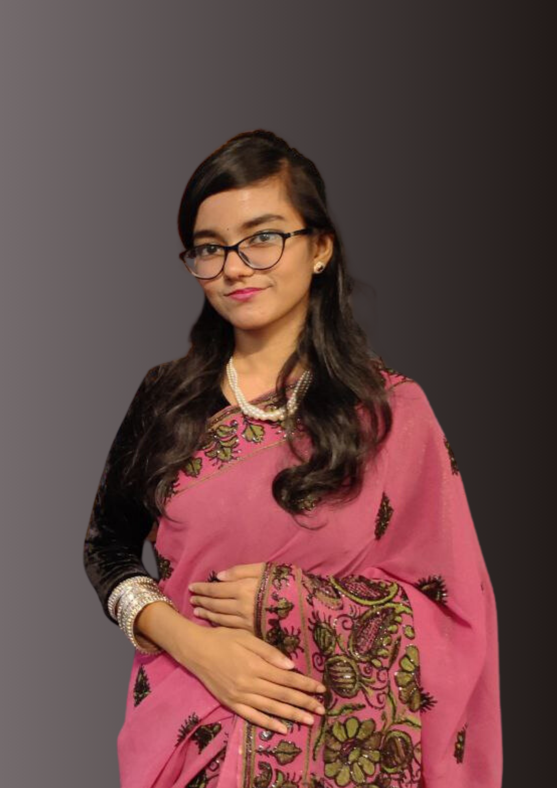

# 🌐 Personal Portfolio



## 👋 Hello, I'm **Saobia Islam**
Tech Enthusiast | Front End Developer |
Exploring IT & Web Development 
---

## 🚀 About Me
- 💻 Aspiring **Full-Stack Developer**
- 🌱 Currently learning **Mern,MySQL and Web Development**
- 🔍 Passionate about **IT, Problem-Solving, and Continuous Learning**
- 📚 Motto: **"Always Learning, Always Growing"**

---

## 🛠 Skills
- **Frontend:** HTML, CSS, JavaScript  
- **Tools:** Git, GitHub  
- **Currently Exploring:** React, Node.js, Next.js, Laravel, My SQL and Web Designing
---

## 📂 Project Overview
This repository contains my personal portfolio website built with:
- ✅ **HTML5** for structure  
- ✅ **CSS3** for styling  
- ✅ **Responsive Design** for all devices  

---

## 🔗 View Live
👉 [**View My Portfolio**](https://Saobia3i.github.io/Portfolio/)  

---

## 📸 Screenshots
### Portfolio Home:


---

## 📬 Connect with Me
- **LinkedIn:** [https://www.linkedin.com/in/saobia-islam-1b173b284?utm_source=share&utm_campaign=share_via&utm_content=profile&utm_medium=android_app](#)
- **GitHub:** [github.com/Saobia3i](#)
- **Email:** islamsaobia@gmail.com 

---

### 📄 How to Use:
1. Clone the repository:
   ```bash
   git clone https://github.com/Saobia3i/Portfolio.git
